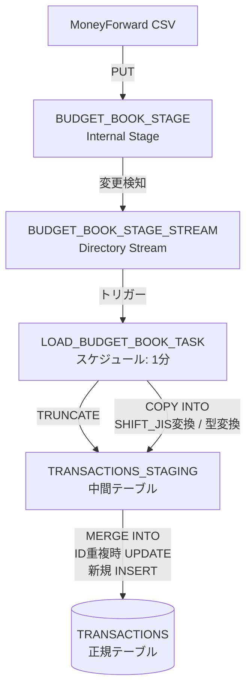
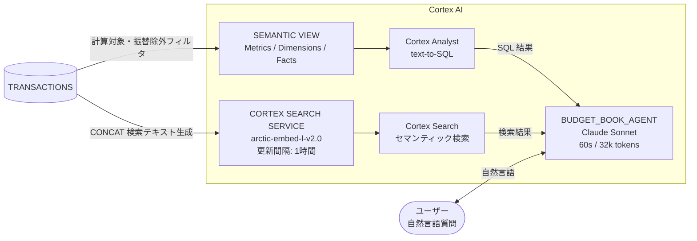

# budget_book データパイプライン

## 図1: データインジェストパイプライン

MoneyForward から出力した CSV ファイルを Snowflake に自動取り込みするフロー。



### 補足

| ステップ | 詳細 |
|---------|------|
| **PUT** | MoneyForward から手動でダウンロードした CSV を `snowsql -q "PUT file://..."` でアップロード |
| **Directory Stream** | ステージへのファイル追加・変更を検知する Snowflake の変更追跡機能 |
| **COPY INTO** | SHIFT_JIS → UTF-8 変換・日付/数値の型変換を実施。`ON_ERROR = CONTINUE` で不正行をスキップ |
| **MERGE INTO** | `ID` カラムをキーに重複チェック。既存行は UPDATE、新規行は INSERT（冪等な取り込みを保証） |

---

## 図2: Cortex AI 分析レイヤー

TRANSACTIONS テーブルを起点に、Cortex Agent が自然言語での家計分析を提供するフロー。



### Semantic View の定義内容

| 種別 | 項目名 | 説明 |
|------|--------|------|
| **Dimension** | TRANSACTION_DATE | 取引日 |
| **Dimension** | DESCRIPTION | 取引内容・店舗名 |
| **Dimension** | INSTITUTION | 保有金融機関・カード名 |
| **Dimension** | MAJOR_CATEGORY | 大項目カテゴリ |
| **Dimension** | MINOR_CATEGORY | 中項目カテゴリ |
| **Dimension** | CALCULATION_TARGET | 計算対象フラグ |
| **Dimension** | TRANSFER_FLAG | 振替フラグ |
| **Fact** | AMOUNT | 金額（負数=支出、正数=収入） |
| **Metric** | MONTHLY_SPENDING | 月別支出合計（振替・ATM除外） |
| **Metric** | CATEGORY_SPENDING | カテゴリ別支出合計 |
| **Metric** | MONTHLY_INCOME | 月別収入合計（振替除外） |

### Cortex Search Service のインデックス対象

```sql
-- 検索テキスト（SEARCH_TEXT）
CONCAT_WS(' ', DESCRIPTION, MAJOR_CATEGORY, MINOR_CATEGORY)

-- フィルタ条件
WHERE CALCULATION_TARGET = 1
  AND TRANSFER_FLAG = 0
```

### Agent のサンプル質問

| 使用ツール | 質問例 |
|-----------|--------|
| Cortex Analyst | 今月の支出合計を教えてください |
| Cortex Analyst | 食費の月別推移を教えてください |
| Cortex Analyst | どのカテゴリに一番お金を使っていますか |
| Cortex Search | コンビニでの支出を調べてください |
