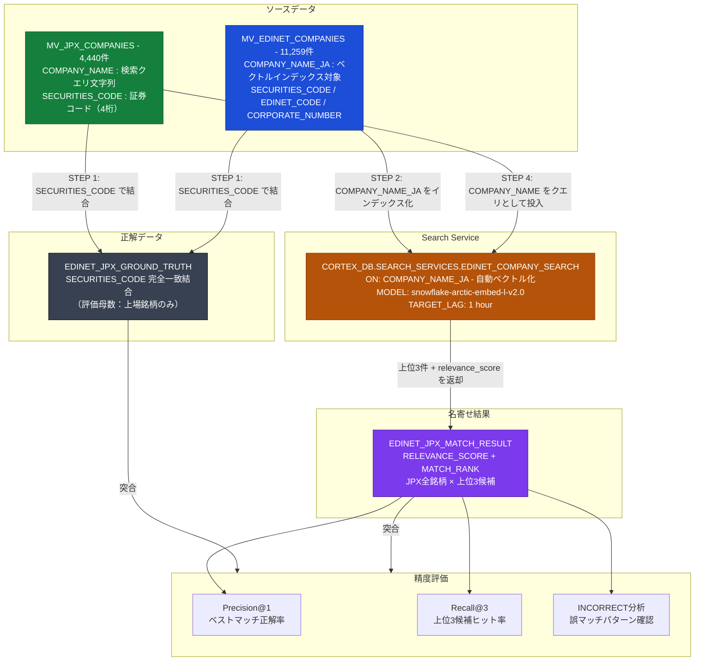

# 名寄せ実験計画書：EDINET × JPX（実データ）

Cortex Search Service を使って、JPX上場銘柄（JPX）とEDINETコードリスト（EDINET）を社名の表記揺れを考慮して紐付ける実験。
SECURITIES_CODE による完全一致結合をグランドトゥルースとして、名寄せ精度を定量評価する。

---

## 実験概要



---

## テーブル選定理由

| 観点 | 内容 |
|------|------|
| **ユースケース** | JPX銘柄をEDINETコードに紐付けて有価証券報告書と連携する |
| **正解データの存在** | `SECURITIES_CODE` が両テーブルに存在 → 正解を定義できる |
| **名寄せの難易度** | `トヨタ自動車`（JPX）vs `株式会社トヨタ自動車`（EDINET）などの表記差異がある |
| **直接の共通キーがないケース** | NTA（法人番号データ）との対比として、今後の発展に活用可能 |

---

## データフロー

| STEP | 処理 | 出力テーブル |
|------|------|-------------|
| 0 | データ確認（件数・証券コード保有率） | — |
| 1 | 正解データ作成（SECURITIES_CODE 結合） | `SANDBOX_DB.WORK.EDINET_JPX_GROUND_TRUTH` |
| 2 | Cortex Search Service 作成（EDINET 社名をインデックス化） | `CORTEX_DB.SEARCH_SERVICES.EDINET_COMPANY_SEARCH` |
| 3 | 単件確認（任意の社名で動作確認） | — |
| 4 | 全件マッチング実行 | `SANDBOX_DB.WORK.EDINET_JPX_MATCH_RESULT` |
| 5 | 精度評価（正解データとの比較） | — |

---

## STEP 0: データ確認

```sql
-- 各マテビューの件数確認
SELECT COUNT(*) FROM RAW_DB.COMPANY_MATCHING.MV_EDINET_COMPANIES;   -- 期待値: ~11,259
SELECT COUNT(*) FROM RAW_DB.COMPANY_MATCHING.MV_JPX_COMPANIES;      -- 期待値: ~4,440

-- EDINET に証券コードが入っている件数（上場企業のみ）
SELECT COUNT(*) AS edinet_with_code
FROM RAW_DB.COMPANY_MATCHING.MV_EDINET_COMPANIES
WHERE SECURITIES_CODE IS NOT NULL AND SECURITIES_CODE != '';

-- サンプル確認（社名の表記確認）
SELECT SECURITIES_CODE, COMPANY_NAME_JA FROM RAW_DB.COMPANY_MATCHING.MV_EDINET_COMPANIES
WHERE SECURITIES_CODE IS NOT NULL AND SECURITIES_CODE != ''
LIMIT 10;

SELECT SECURITIES_CODE, COMPANY_NAME FROM RAW_DB.COMPANY_MATCHING.MV_JPX_COMPANIES
LIMIT 10;
```

---

## STEP 1: 正解データ作成（SECURITIES_CODE による完全一致結合）

```sql
-- EDINET と JPX を SECURITIES_CODE で直接結合（グランドトゥルース）
-- 4桁ゼロ埋め統一（コードの桁数揺れを吸収）
CREATE OR REPLACE TABLE SANDBOX_DB.WORK.EDINET_JPX_GROUND_TRUTH AS
SELECT
    j.SECURITIES_CODE,
    j.COMPANY_NAME       AS JPX_NAME,
    e.COMPANY_NAME_JA    AS EDINET_NAME,
    e.EDINET_CODE,
    e.CORPORATE_NUMBER,
    j.INDUSTRY_33        AS JPX_INDUSTRY
FROM RAW_DB.COMPANY_MATCHING.MV_JPX_COMPANIES j
INNER JOIN RAW_DB.COMPANY_MATCHING.MV_EDINET_COMPANIES e
    ON LPAD(j.SECURITIES_CODE::VARCHAR, 4, '0') = LPAD(e.SECURITIES_CODE::VARCHAR, 4, '0')
WHERE j.SECURITIES_CODE IS NOT NULL
  AND j.SECURITIES_CODE != '-';

-- 正解件数（この件数が精度評価の分母になる）
SELECT COUNT(*) AS ground_truth_count FROM SANDBOX_DB.WORK.EDINET_JPX_GROUND_TRUTH;

-- 社名の表記差異を目視確認（名寄せの難易度感をつかむ）
SELECT SECURITIES_CODE, JPX_NAME, EDINET_NAME
FROM SANDBOX_DB.WORK.EDINET_JPX_GROUND_TRUTH
LIMIT 20;
```

> **確認ポイント**: JPX_NAME と EDINET_NAME の差異パターン（株式会社の有無・略称・英字混在など）を把握しておく

---

## STEP 2: Cortex Search Service 作成

```sql
-- EDINET 社名をベクトルインデックス化
-- JPX 社名をクエリとして投入するため EDINET 側を索引化する
-- Cortex オブジェクトは CORTEX_DB.SEARCH_SERVICES スキーマに統一して配置する
CREATE OR REPLACE CORTEX SEARCH SERVICE CORTEX_DB.SEARCH_SERVICES.EDINET_COMPANY_SEARCH
    ON COMPANY_NAME_JA
    ATTRIBUTES EDINET_CODE, SECURITIES_CODE, CORPORATE_NUMBER, COMPANY_NAME_KANA
    WAREHOUSE = SANDBOX_WH
    TARGET_LAG = '1 hour'
    AS (
        SELECT COMPANY_NAME_JA, EDINET_CODE, SECURITIES_CODE, CORPORATE_NUMBER, COMPANY_NAME_KANA
        FROM RAW_DB.COMPANY_MATCHING.MV_EDINET_COMPANIES
        WHERE COMPANY_NAME_JA IS NOT NULL
    );
```

```sql
-- ACTIVE になるまで待機（数分かかる）
SHOW CORTEX SEARCH SERVICES IN DATABASE CORTEX_DB;
-- status が ACTIVE になったら次へ進む
```

---

## STEP 3: 単件確認（1社ずつ結果を確認）

任意の JPX 社名を `"query"` に指定して動作確認する。

```sql
-- 生 JSON で確認（まず動作確認）
SELECT PARSE_JSON(
    SNOWFLAKE.CORTEX.SEARCH_PREVIEW(
        'CORTEX_DB.SEARCH_SERVICES.EDINET_COMPANY_SEARCH',
        '{
            "query": "トヨタ自動車",
            "columns": ["COMPANY_NAME_JA", "EDINET_CODE", "SECURITIES_CODE"],
            "limit": 3
        }'
    )
):results AS candidates;
```

```sql
-- 見やすく行展開したバージョン（社名を書き換えて試す）
WITH raw AS (
    SELECT PARSE_JSON(
        SNOWFLAKE.CORTEX.SEARCH_PREVIEW(
            'CORTEX_DB.SEARCH_SERVICES.EDINET_COMPANY_SEARCH',
            '{"query": "トヨタ自動車", "columns": ["COMPANY_NAME_JA","EDINET_CODE","SECURITIES_CODE"], "limit": 3}'
        )
    ):results AS results
)
SELECT
    f.value:COMPANY_NAME_JA::VARCHAR  AS EDINET_NAME,
    f.value:EDINET_CODE::VARCHAR      AS EDINET_CODE,
    f.value:SECURITIES_CODE::VARCHAR  AS SECURITIES_CODE,
    f.value:score::FLOAT              AS SCORE,
    ROW_NUMBER() OVER (ORDER BY f.value:score::FLOAT DESC) AS RANK
FROM raw, LATERAL FLATTEN(INPUT => results) f;
```

> **確認ポイント**: RANK=1 の候補が正しい EDINET エントリを指しているか、SCORE の目安値はどの程度か

---

## STEP 4: 全件マッチング

```sql
-- JPX 全銘柄に対して EDINET をサーチし、上位3候補を取得
-- ※ 実行に数分かかる（4,440件 × Cortex Search）
CREATE OR REPLACE TABLE SANDBOX_DB.WORK.EDINET_JPX_MATCH_RESULT AS
SELECT
    j.SECURITIES_CODE                         AS JPX_SECURITIES_CODE,
    j.COMPANY_NAME                            AS JPX_NAME,
    f.value:COMPANY_NAME_JA::VARCHAR          AS MATCHED_EDINET_NAME,
    f.value:EDINET_CODE::VARCHAR              AS MATCHED_EDINET_CODE,
    f.value:SECURITIES_CODE::VARCHAR          AS MATCHED_SECURITIES_CODE,
    f.value:score::FLOAT                      AS RELEVANCE_SCORE,
    ROW_NUMBER() OVER (
        PARTITION BY j.SECURITIES_CODE
        ORDER BY f.value:score::FLOAT DESC
    )                                         AS MATCH_RANK
FROM RAW_DB.COMPANY_MATCHING.MV_JPX_COMPANIES j,
LATERAL FLATTEN(
    INPUT => PARSE_JSON(
        SNOWFLAKE.CORTEX.SEARCH_PREVIEW(
            'CORTEX_DB.SEARCH_SERVICES.EDINET_COMPANY_SEARCH',
            OBJECT_CONSTRUCT(
                'query',   j.COMPANY_NAME,
                'columns', ARRAY_CONSTRUCT('COMPANY_NAME_JA', 'EDINET_CODE', 'SECURITIES_CODE'),
                'limit',   3
            )::VARCHAR
        )
    ):results
) f;
```

```sql
-- 実行完了確認
SELECT COUNT(DISTINCT JPX_SECURITIES_CODE) AS matched_companies
FROM SANDBOX_DB.WORK.EDINET_JPX_MATCH_RESULT;
-- 期待値: ~4,440（JPXの全銘柄数）

-- 結果サンプル確認
SELECT * FROM SANDBOX_DB.WORK.EDINET_JPX_MATCH_RESULT
WHERE MATCH_RANK <= 2
LIMIT 20;
```

---

## STEP 5: 精度評価

### 評価指標の定義

| 指標 | 計算式 | 意味 |
|------|--------|------|
| **Precision@1** | 正解件数（RANK=1 かつ一致） ÷ 評価母数 | 1位の候補だけを使った場合の正解率 |
| **Recall@3** | 上位3件以内に正解が含まれた件数 ÷ 評価母数 | 候補3件提示したときに正解が含まれる率 |

> 評価母数 = `EDINET_JPX_GROUND_TRUTH` の件数（SECURITIES_CODE で紐付けできた上場銘柄数）

### Precision@1（ベストマッチが正解かどうか）

```sql
WITH best AS (
    SELECT * FROM SANDBOX_DB.WORK.EDINET_JPX_MATCH_RESULT
    WHERE MATCH_RANK = 1
),
eval AS (
    SELECT
        g.SECURITIES_CODE,
        g.JPX_NAME,
        g.EDINET_NAME         AS CORRECT_NAME,
        b.MATCHED_EDINET_NAME AS PREDICTED_NAME,
        b.RELEVANCE_SCORE,
        CASE
            WHEN LPAD(g.SECURITIES_CODE::VARCHAR, 4, '0') = LPAD(b.MATCHED_SECURITIES_CODE::VARCHAR, 4, '0')
            THEN 'CORRECT'
            ELSE 'INCORRECT'
        END AS RESULT
    FROM SANDBOX_DB.WORK.EDINET_JPX_GROUND_TRUTH g
    LEFT JOIN best b
        ON LPAD(g.SECURITIES_CODE::VARCHAR, 4, '0') = LPAD(b.JPX_SECURITIES_CODE::VARCHAR, 4, '0')
)
SELECT
    RESULT,
    COUNT(*)                                         AS CNT,
    ROUND(COUNT(*) * 100.0 / SUM(COUNT(*)) OVER (), 1) AS PCT
FROM eval
GROUP BY RESULT
ORDER BY CNT DESC;
```

### 誤マッチの内容確認（INCORRECT パターン把握）

```sql
WITH best AS (
    SELECT * FROM SANDBOX_DB.WORK.EDINET_JPX_MATCH_RESULT WHERE MATCH_RANK = 1
)
SELECT
    g.SECURITIES_CODE,
    g.JPX_NAME,
    g.EDINET_NAME          AS CORRECT,
    b.MATCHED_EDINET_NAME  AS PREDICTED,
    b.RELEVANCE_SCORE
FROM SANDBOX_DB.WORK.EDINET_JPX_GROUND_TRUTH g
JOIN best b
    ON LPAD(g.SECURITIES_CODE::VARCHAR, 4, '0') = LPAD(b.JPX_SECURITIES_CODE::VARCHAR, 4, '0')
WHERE LPAD(g.SECURITIES_CODE::VARCHAR, 4, '0') != LPAD(b.MATCHED_SECURITIES_CODE::VARCHAR, 4, '0')
ORDER BY b.RELEVANCE_SCORE DESC
LIMIT 20;
```

> **確認ポイント**: 高スコアなのに誤マッチしているケースが特に注目。同名グループ会社の誤マッチなど実務的な課題が見えてくる

### Recall@3（正解が上位3候補に含まれる率）

> **計算式**: `HIT ÷ TOTAL` — 正解が上位3件以内に1つでも入れば HIT=1 とカウント

```sql
WITH top3 AS (
    SELECT * FROM SANDBOX_DB.WORK.EDINET_JPX_MATCH_RESULT
    WHERE MATCH_RANK <= 3
),
hit AS (
    SELECT
        g.SECURITIES_CODE,
        MAX(
            CASE WHEN LPAD(g.SECURITIES_CODE::VARCHAR, 4, '0') = LPAD(t.MATCHED_SECURITIES_CODE::VARCHAR, 4, '0')
                 THEN 1 ELSE 0 END
        ) AS IN_TOP3
    FROM SANDBOX_DB.WORK.EDINET_JPX_GROUND_TRUTH g
    JOIN top3 t
        ON LPAD(g.SECURITIES_CODE::VARCHAR, 4, '0') = LPAD(t.JPX_SECURITIES_CODE::VARCHAR, 4, '0')
    GROUP BY g.SECURITIES_CODE
)
SELECT
    SUM(IN_TOP3)                                  AS HIT,
    COUNT(*)                                       AS TOTAL,
    ROUND(SUM(IN_TOP3) * 100.0 / COUNT(*), 1)     AS RECALL_AT_3_PCT
FROM hit;
```

> **読み方**: Precision@1 が低くても Recall@3 が高ければ、「候補3件を人間がレビューすれば正解にたどりつける」ことを意味する

---

## 既存実験からの改善点

| 観点 | ダミーデータ実験（既存） | 実データ実験（今回） |
|------|----------------------|-------------------|
| 評価方法 | スコア分布の目視確認 | **Precision@1 / Recall@3** で定量評価 |
| 正解データ | なし | **SECURITIES_CODE 結合**でグランドトゥルースを自動生成 |
| 証券コード比較 | — | `LPAD(..., 4, '0')` で桁数揺れを吸収 |
| 誤マッチ分析 | なし | **INCORRECT パターンを別クエリで抽出**しパターン分類 |
| 件数規模 | 15〜18件 | **4,440件（JPX全銘柄）** |
