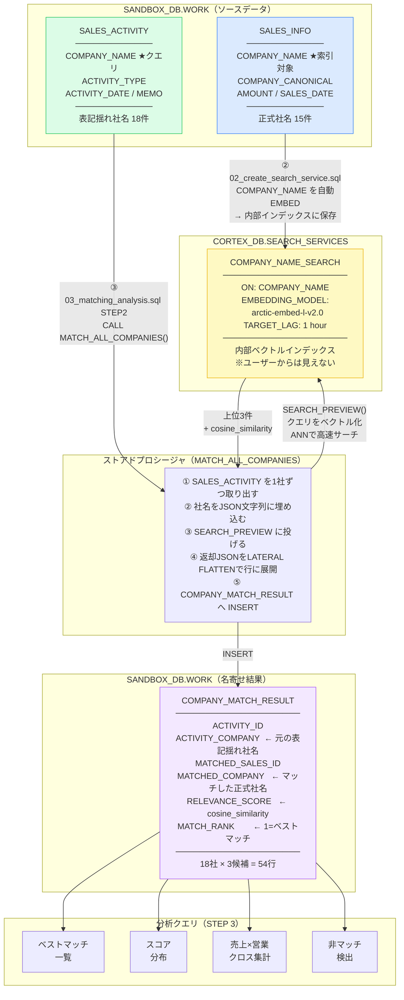

# ベクトル類似度による企業名名寄せ実験

Cortex Search Service を使って、表記揺れのある社名を持つ2テーブルを意味的に紐付ける実験的実装。

---

## 全体フロー図



---

## データフロー

| ステップ | ファイル | やること |
|---------|---------|---------|
| ① | `01_setup_tables.sql` | 3テーブルのDDL + サンプルデータINSERT |
| ② | `02_create_search_service.sql` | SALES_INFO 社名を自動ベクトル化して索引化 |
| ③ | `03_matching_analysis.sql` STEP1 | 個別クエリで動作確認 |
| ④ | `03_matching_analysis.sql` STEP2 | SALES_ACTIVITY 全件クエリ → COMPANY_MATCH_RESULT へ保存 |
| ⑤ | `03_matching_analysis.sql` STEP3 | 紐付き結果でビジネス分析 |

---

## Cortex Search Service のインデックス化の仕組み

```
SALES_INFO テーブル
    ↓ CREATE CORTEX SEARCH SERVICE 時
COMPANY_NAME 列を自動で EMBED（ベクトル化）
    ↓ 内部ベクトルストアに保存（ユーザーからは見えない）
    ↓ TARGET_LAG に従って定期的に差分更新

クエリ（SALES_ACTIVITY の COMPANY_NAME）
    ↓ 同じモデルで EMBED → クエリベクトル生成
    ↓ ANN（近似最近傍探索）でインデックスを高速サーチ
結果: relevance_score 付きの候補リスト
```

### 通常の CROSS JOIN との違い

| 観点 | CROSS JOIN + VECTOR_COSINE_SIMILARITY | Cortex Search Service |
|------|--------------------------------------|----------------------|
| ベクトル保存 | 自分でテーブルに保存 | サービス内部に自動管理 |
| 検索方式 | 全件総当り | ANN インデックス（高速）|
| スケール | 数百件まで | 数億件まで対応 |
| 更新 | 手動で再 INSERT | TARGET_LAG で自動差分更新 |

---

## テーブル設計

### SALES_INFO（売上情報）

- `COMPANY_NAME`（`ON` 句）: Search Service がベクトルインデックスを作成する対象列
- `COMPANY_CANONICAL`: 正規化社名。グループ集計（トヨタグループ全体の売上合計など）に活用
- `ATTRIBUTES` に指定した列（SALES_ID, AMOUNT, SALES_DATE）: フィルタや返却値として使用可能

### SALES_ACTIVITY（営業活動情報）

- `COMPANY_NAME`: Search Service への検索クエリ文字列として使用
- Search Service を作成しない（クエリを投げる側）

### COMPANY_MATCH_RESULT（名寄せ結果テーブル）

- 名寄せ実行のたびに INSERT（もしくは MERGE で更新）
- `MATCH_RANK = 1` がベストマッチ、`2` 以降は次点候補
- 分析クエリのベーステーブルとなる

---

## 実行手順

```sql
-- 1. テーブル作成・サンプルデータ投入
-- experiments/company_matching/01_setup_tables.sql を実行

-- 2. Search Service 作成（数分待機）
-- experiments/company_matching/02_create_search_service.sql を実行
-- SHOW CORTEX SEARCH SERVICES で ACTIVE になるまで待つ

-- 3. 名寄せ実行・分析
-- experiments/company_matching/03_matching_analysis.sql を順番に実行
```

---

## 注意事項

- `SEARCH_PREVIEW` は SQL 実験用 API → 本番では Python / REST API を推奨
- `LATERAL FLATTEN` の展開結果は `:results` キー配下を指定すること
- `FR_CORTEX_ADMIN` ロールが `DEVELOPER_ROLE` に付与済みのため追加権限設定は不要
